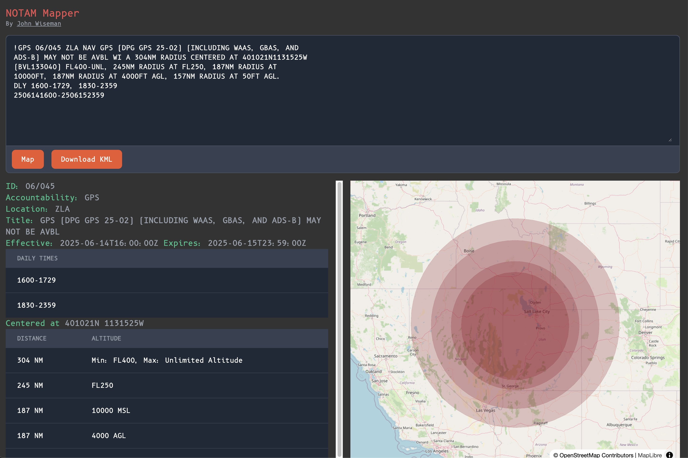

# NOTAM Mapper frontend

NOTAM Mapper takes freeform text from NOTAMs, parses them, and displays them on
a map.

This is a sveltekit frontend for the NOTAM Mapper project. See
https://github.com/wiseman/notam-mapper-be for the backend code.

You can try it at https://notam-mapper.obliscence.com/




## Installation

```
pnpm install
```

## Running

First set the `API_SERVER` environment variable to the URL of the backend, e.g.
`API_SERVER=http://localhost:8000`.

Then set the `ORIGIN` environment variable to the URL of the frontend, e.g.
`ORIGIN=http://localhost:5173`.

To run in dev mode:
```
pnpm dev
```

To build and run in production mode:
```
pnpm build
node build
```

To deploy:

```bash
tar cf deploy.tar .svelte-kit/ app.pcss  captain-definition Dockerfile package-lock.json package.json pnpm-lock.yaml postcss.config.cjs src static svelte.config.js tailwind.config.ts tsconfig.json vite.config.ts
```

Then deploy the tarball to CapRover.